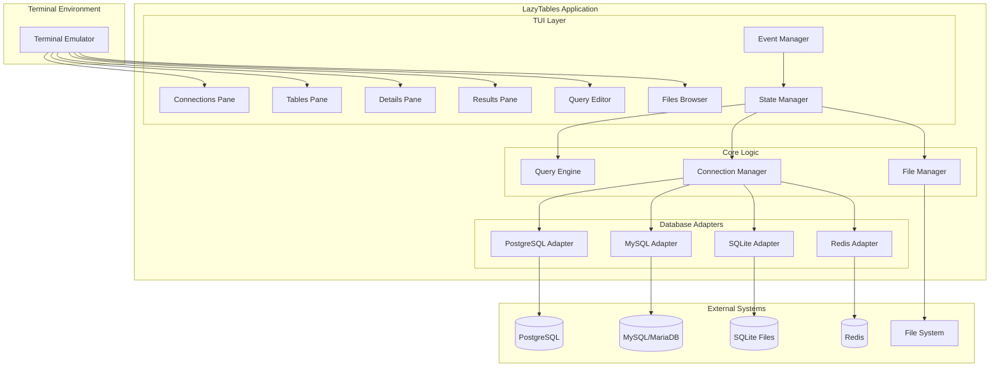
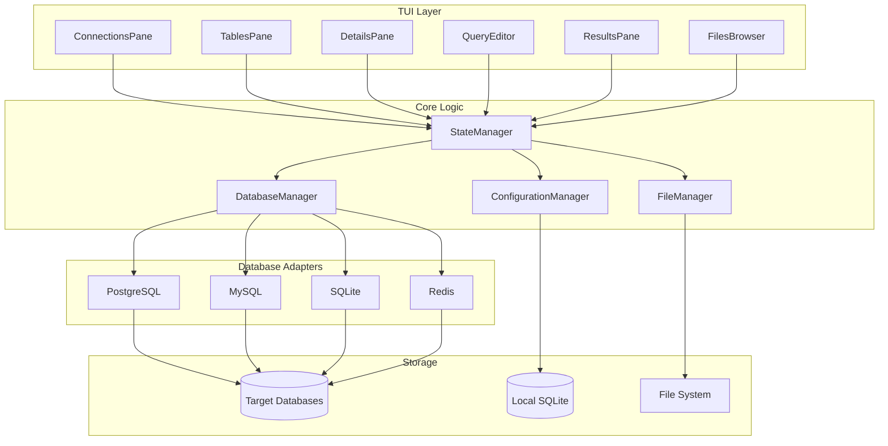

# LazyTables TUI Architecture Document

## Introduction

This document outlines the complete TUI (Terminal User Interface) architecture for **LazyTables**, a terminal-based SQL database viewer and editor designed for developers who value keyboard-driven workflows. Built with Rust and featuring vim motions throughout, it provides a fast, intuitive interface for database management without leaving the terminal.

This architecture serves as the single source of truth for AI-driven development, ensuring consistency across all system components including the TUI framework, database adapters, state management, and cross-platform terminal compatibility.

### Starter Template or Existing Project

**Status:** Brownfield Enhancement Project - Building on existing LazyTables foundation

**Current Foundation:**
- Rust-based TUI application using Ratatui framework
- Six-pane fixed layout with vim-style navigation
- PostgreSQL support via async adapters
- Basic SQL query editor and file management
- Connection management with secure credential storage

**Enhancement Goals:**
- Multi-database support (MySQL, MariaDB, SQLite, Redis)
- Enhanced query editor with syntax highlighting
- Advanced data export capabilities
- Database-specific UI adaptations

**Constraints Imposed:**
- Must preserve existing six-pane layout and vim navigation
- Backward compatibility with current PostgreSQL connections
- Terminal-only interface (no GUI components)
- Single binary deployment model

### Change Log

| Date | Version | Description | Author |
|------|---------|-------------|--------|
| 2025-01-19 | v1.0 | Initial TUI architecture for multi-database support | Architect |

## High Level Architecture

### Technical Summary

LazyTables employs a **terminal-native architecture** built on Rust's async ecosystem with Ratatui providing the TUI foundation. The system uses a **six-pane fixed layout** with database adapters implementing a unified interface for PostgreSQL, MySQL, MariaDB, SQLite, and Redis. **Event-driven state management** coordinates pane updates and user interactions through vim-style keyboard navigation. The architecture prioritizes **terminal performance** (sub-100ms startup, 60fps scrolling) while maintaining **cross-platform compatibility** across major terminal emulators. This design achieves the PRD goal of creating the "LazyGit for databases" through elegant keyboard-driven workflows that rival GUI database tools.

### Platform and Infrastructure Choice

For a TUI application, the "platform" is the terminal ecosystem rather than cloud infrastructure:

**Platform Options Considered:**

1. **Native Terminal + Rust Ecosystem** ⭐ **RECOMMENDED**
   - Pros: Maximum performance, single binary, cross-platform, mature TUI libraries
   - Cons: Terminal capability variations, no web/mobile access
   - Stack: Ratatui + Tokio + native database drivers

2. **Cross-Platform Terminal (NCurses-based)**
   - Pros: Broader terminal compatibility, proven ecosystem
   - Cons: C FFI complexity, less Rust-native development experience
   - Stack: pancurses + async wrappers

3. **Terminal + Web Hybrid**
   - Pros: Both terminal and web access, broader user base
   - Cons: Complexity overhead, divides development focus
   - Stack: Ratatui + web terminal emulator

**Selected Platform:** Native Terminal + Rust Ecosystem
**Key Libraries:** Ratatui (TUI), Tokio (async runtime), Crossterm (terminal abstraction)
**Target Terminals:** Major terminal emulators (iTerm2, Terminal.app, Alacritty, Windows Terminal, GNOME Terminal)
**Deployment Host:** Single binary distribution for macOS, Linux (no Windows support per PRD)

### Repository Structure

**Structure:** Monorepo with feature-based organization
**Build Tool:** Native Cargo workspace (no additional monorepo tooling needed)
**Package Organization:** Single binary with modular crate structure for database adapters

```
lazytables/
├── Cargo.toml                 # Workspace root
├── src/                       # Main application
├── crates/                    # Internal crates
│   ├── database-adapters/     # Database connection abstractions
│   ├── tui-components/        # Reusable TUI widgets
│   └── query-engine/          # SQL parsing and execution
└── tests/                     # Integration tests
```

### High Level Architecture Diagram



### Architectural Patterns

- **Event-Driven Architecture:** TUI events drive state changes with async message passing between panes - _Rationale:_ Terminal input is inherently event-based, and this pattern enables responsive UI without blocking database operations
- **Adapter Pattern:** Unified database interface with database-specific implementations - _Rationale:_ Enables consistent UI across different database types while accommodating database-specific features
- **State Management Pattern:** Centralized application state with immutable updates - _Rationale:_ Prevents race conditions in async environment and simplifies debugging of complex UI interactions
- **Six-Pane Layout Pattern:** Fixed spatial organization with contextual focus management - _Rationale:_ Provides predictable navigation model essential for vim-style keyboard workflows
- **Async-First Pattern:** Non-blocking database operations with streaming results - _Rationale:_ Maintains UI responsiveness during long-running queries and large dataset operations
- **Plugin Architecture Pattern:** Modular database adapters with runtime selection - _Rationale:_ Enables optional database support and reduces binary size for unused databases

## Tech Stack

This is the **DEFINITIVE technology selection** for the entire LazyTables project. All development must use these exact versions and technologies.

### Technology Stack Table

| Category | Technology | Version | Purpose | Rationale |
|----------|------------|---------|----------|-----------|
| Core Language | Rust | 1.75+ | System programming, memory safety, performance | Memory safety critical for TUI performance, excellent async support, strong typing prevents runtime errors |
| TUI Framework | Ratatui | 0.25+ | Terminal user interface rendering | Most mature Rust TUI library, active development, excellent widget ecosystem |
| Async Runtime | Tokio | 1.35+ | Async database operations, non-blocking I/O | Industry standard for Rust async, required for responsive TUI during database operations |
| Terminal Abstraction | Crossterm | 0.27+ | Cross-platform terminal control | Ratatui dependency, handles terminal differences across platforms |
| PostgreSQL Driver | SQLx | 0.7+ | Async PostgreSQL connectivity | Compile-time checked queries, excellent async support, connection pooling |
| MySQL Driver | SQLx | 0.7+ | Async MySQL/MariaDB connectivity | Same interface as PostgreSQL driver, maintains consistency across SQL databases |
| SQLite Driver | SQLx | 0.7+ | Async SQLite file database access | Local file support, same SQLx interface for consistency |
| Redis Driver | redis-rs | 0.24+ | Async Redis key-value operations | Most mature Redis client for Rust, async/await support |
| Configuration | serde + toml | 1.0+ / 0.8+ | Configuration file parsing and serialization | Human-readable config format, strong typing for validation |
| Error Handling | thiserror + anyhow | 1.0+ / 1.0+ | Structured error types and error propagation | Ergonomic error handling essential for database operations |
| Logging | tracing + tracing-subscriber | 0.1+ / 0.3+ | Structured logging and observability | Async-aware logging, essential for debugging TUI and database issues |
| Security | keyring + sha2 | 2.0+ / 0.10+ | Credential storage and hashing | OS-native credential storage, secure password handling |
| Testing Framework | tokio-test + sqlx-test | 0.4+ / 0.7+ | Async testing and database test utilities | Async test support, database integration testing |
| Build Tool | Cargo | 1.75+ | Rust package management and building | Native Rust tooling, workspace support for modular architecture |
| CLI Parsing | clap | 4.0+ | Command line argument processing | Feature-rich CLI parsing for debug options and config paths |
| File Watching | notify | 6.0+ | SQL file change detection | Auto-reload SQL files when modified externally |
| Syntax Highlighting | syntect | 5.0+ | SQL syntax highlighting in terminal | Terminal-compatible syntax highlighting for query editor |
| Data Export | csv + serde_json | 1.3+ / 1.0+ | CSV and JSON export functionality | Standard serialization formats for query result export |
| Development Tools | cargo-watch | 8.0+ | Auto-rebuild on file changes | Essential for fast development iteration with TUI hot-reload |
| Benchmarking | criterion | 0.5+ | Performance testing and regression detection | Validate startup time and scrolling performance requirements |
| Dependency Management | cargo-deny | 0.14+ | License compliance and security scanning | Ensure all dependencies meet security and legal requirements |

### Single Binary Strategy

**Feature Flag Configuration:**
```toml
[features]
default = ["postgresql"]
postgresql = ["sqlx/postgres", "sqlx/runtime-tokio-rustls"]
mysql = ["sqlx/mysql", "sqlx/runtime-tokio-rustls"]
sqlite = ["sqlx/sqlite", "sqlx/runtime-tokio-rustls"]
redis = ["redis/tokio-comp"]
all-databases = ["postgresql", "mysql", "sqlite", "redis"]
syntax-highlighting = ["syntect"]
file-watching = ["notify"]
full = ["all-databases", "syntax-highlighting", "file-watching"]
```

**Build Optimization:**
- **Custom Builds**: `cargo install lazytables --features mysql,sqlite` (only needed databases)
- **Full Build**: `cargo install lazytables --features full` (all capabilities)
- **Development**: `cargo watch -x "run --features full"` (fast iteration with hot-reload)

**Installation Simplicity:**
```bash
# Default PostgreSQL support
cargo install lazytables

# All databases
cargo install lazytables --features all-databases

# Development setup
cargo install cargo-watch
make dev  # Uses cargo-watch for auto-reload
```

## Data Models

Based on the PRD requirements and LazyTables' multi-database architecture, I need to define the core data models that will be shared across the TUI and database adapters. **All configuration and metadata is stored locally in SQLite** for fast access and offline capabilities.

### Connection

**Purpose:** Represents a database connection configuration with database-specific parameters and secure credential storage. Stored locally in SQLite database (~/.lazytables/config.db) for persistence and fast retrieval.

**Key Attributes:**
- id: UUID - Unique identifier for the connection
- name: String - Human-readable connection name
- database_type: DatabaseType - Enum of supported database types
- connection_config: DatabaseConfig - Database-specific connection parameters
- is_active: bool - Current connection status
- created_at: DateTime - Connection creation timestamp
- last_used: DateTime - Last successful connection time

#### TypeScript Interface
```typescript
interface Connection {
  id: string;
  name: string;
  database_type: 'PostgreSQL' | 'MySQL' | 'MariaDB' | 'SQLite' | 'Redis';
  connection_config: DatabaseConfig;
  is_active: boolean;
  created_at: string;
  last_used: string;
}

type DatabaseConfig =
  | PostgreSQLConfig
  | MySQLConfig
  | SQLiteConfig
  | RedisConfig;

interface PostgreSQLConfig {
  host: string;
  port: number;
  database: string;
  username: string;
  ssl_mode: 'disable' | 'prefer' | 'require';
  schema?: string;
}
```

#### Relationships
- Has many Query objects (query history stored in SQLite)
- Has many TableMetadata objects (cached table information in SQLite)
- Belongs to ConnectionGroup (optional connection organization)

### SQLiteSchema

**Purpose:** Local configuration and metadata storage schema using SQLite as the embedded database for LazyTables configuration.

#### SQLite Tables
```sql
-- Connection configurations
CREATE TABLE connections (
    id TEXT PRIMARY KEY,
    name TEXT NOT NULL,
    database_type TEXT NOT NULL,
    connection_config TEXT NOT NULL, -- JSON serialized config
    is_active BOOLEAN DEFAULT 0,
    created_at DATETIME DEFAULT CURRENT_TIMESTAMP,
    last_used DATETIME
);

-- Query history per connection
CREATE TABLE query_history (
    id TEXT PRIMARY KEY,
    connection_id TEXT NOT NULL,
    query_text TEXT NOT NULL,
    executed_at DATETIME DEFAULT CURRENT_TIMESTAMP,
    execution_time_ms INTEGER,
    result_count INTEGER,
    FOREIGN KEY (connection_id) REFERENCES connections(id)
);

-- Cached table metadata for performance
CREATE TABLE table_metadata (
    id TEXT PRIMARY KEY,
    connection_id TEXT NOT NULL,
    table_name TEXT NOT NULL,
    schema_name TEXT,
    metadata_json TEXT NOT NULL, -- Serialized table info
    cached_at DATETIME DEFAULT CURRENT_TIMESTAMP,
    FOREIGN KEY (connection_id) REFERENCES connections(id)
);

-- Application settings
CREATE TABLE app_settings (
    key TEXT PRIMARY KEY,
    value TEXT NOT NULL,
    updated_at DATETIME DEFAULT CURRENT_TIMESTAMP
);
```

#### Relationships
- **Local Storage**: ~/.lazytables/config.db (single SQLite file)
- **Performance**: Fast queries for connection lists, query history, cached metadata
- **Security**: Sensitive credentials still use OS keychain, only references stored in SQLite

## API Specification

LazyTables uses **internal Rust trait-based APIs** rather than HTTP REST APIs, since this is a single-process TUI application. The "API" is the interface between TUI components and database adapters.

### Database Adapter Trait Interface

**Purpose:** Unified async interface that all database adapters implement, enabling consistent TUI behavior across PostgreSQL, MySQL, SQLite, and Redis.

```rust
#[async_trait]
pub trait DatabaseAdapter: Send + Sync + Clone {
    type Connection: Send + Sync;
    type QueryResult: Send + Sync;
    type Error: Send + Sync + std::error::Error;

    // Connection Management
    async fn connect(&self, config: &ConnectionConfig) -> Result<Self::Connection, Self::Error>;
    async fn disconnect(&self, conn: Self::Connection) -> Result<(), Self::Error>;
    async fn test_connection(&self, config: &ConnectionConfig) -> Result<bool, Self::Error>;
    async fn get_connection_info(&self, conn: &Self::Connection) -> Result<ConnectionInfo, Self::Error>;

    // Schema Operations
    async fn list_databases(&self, conn: &Self::Connection) -> Result<Vec<DatabaseInfo>, Self::Error>;
    async fn list_tables(&self, conn: &Self::Connection, database: Option<&str>) -> Result<Vec<TableInfo>, Self::Error>;
    async fn get_table_schema(&self, conn: &Self::Connection, table: &TableRef) -> Result<TableSchema, Self::Error>;
    async fn get_table_indexes(&self, conn: &Self::Connection, table: &TableRef) -> Result<Vec<IndexInfo>, Self::Error>;

    // Query Operations
    async fn execute_query(&self, conn: &Self::Connection, query: &str) -> Result<Self::QueryResult, Self::Error>;
    async fn execute_statement(&self, conn: &Self::Connection, statement: &str) -> Result<u64, Self::Error>;
    async fn stream_query_results(&self, conn: &Self::Connection, query: &str) -> Result<QueryStream<Self::QueryResult>, Self::Error>;

    // Database-Specific Features
    fn supports_feature(&self, feature: DatabaseFeature) -> bool;
}
```

### Core Data Structures

```rust
// Connection configuration (stored in SQLite)
#[derive(Debug, Clone, Serialize, Deserialize)]
pub struct ConnectionConfig {
    pub id: Uuid,
    pub name: String,
    pub database_type: DatabaseType,
    pub connection_params: ConnectionParams,
}

#[derive(Debug, Clone, Serialize, Deserialize)]
pub enum DatabaseType {
    PostgreSQL,
    MySQL,
    MariaDB,
    SQLite,
    Redis,
}

// Query results with pagination support
#[derive(Debug, Clone)]
pub struct QueryResult {
    pub columns: Vec<ColumnInfo>,
    pub rows: Vec<Row>,
    pub affected_rows: Option<u64>,
    pub execution_time: Duration,
    pub has_more: bool,
    pub total_count: Option<u64>,
}

// Table metadata for UI display
#[derive(Debug, Clone, Serialize, Deserialize)]
pub struct TableInfo {
    pub name: String,
    pub schema: Option<String>,
    pub table_type: TableType, // Table, View, MaterializedView
    pub row_count: Option<u64>,
    pub size_bytes: Option<u64>,
    pub comment: Option<String>,
}

// Database-specific features
#[derive(Debug, Clone, Copy, PartialEq, Eq)]
pub enum DatabaseFeature {
    Schemas,
    Views,
    MaterializedViews,
    Triggers,
    StoredProcedures,
    FullTextSearch,
    JsonSupport,
    ArraySupport,
    TransactionSupport,
    StreamingResults,
}
```

### TUI to Adapter Communication Pattern

**Event-Driven Architecture:**
```rust
// TUI events that trigger database operations
#[derive(Debug, Clone)]
pub enum DatabaseEvent {
    ConnectToDatabase { connection_id: Uuid },
    RefreshTableList { connection_id: Uuid },
    ExecuteQuery { connection_id: Uuid, query: String },
    LoadTableData { connection_id: Uuid, table: TableRef, page: usize },
}

// Database adapter responses
#[derive(Debug, Clone)]
pub enum DatabaseResponse {
    ConnectionEstablished { connection_info: ConnectionInfo },
    TableListUpdated { tables: Vec<TableInfo> },
    QueryExecuted { result: QueryResult },
    TableDataLoaded { data: QueryResult },
    Error { error: DatabaseError },
}
```

### Async Message Passing

```rust
// Channel-based communication between TUI and adapters
pub struct DatabaseManager {
    event_sender: mpsc::UnboundedSender<DatabaseEvent>,
    response_receiver: broadcast::Receiver<DatabaseResponse>,
    adapters: HashMap<DatabaseType, Box<dyn DatabaseAdapter>>,
    active_connections: HashMap<Uuid, ActiveConnection>,
}

impl DatabaseManager {
    pub async fn handle_event(&mut self, event: DatabaseEvent) {
        match event {
            DatabaseEvent::ExecuteQuery { connection_id, query } => {
                if let Some(connection) = self.active_connections.get(&connection_id) {
                    let adapter = &self.adapters[&connection.database_type];

                    // Execute query asynchronously
                    tokio::spawn(async move {
                        let result = adapter.execute_query(&connection.handle, &query).await;
                        // Send response back to TUI
                        self.send_response(DatabaseResponse::QueryExecuted { result }).await;
                    });
                }
            }
            // ... other event handlers
        }
    }
}
```

## Components

LazyTables is organized into **logical components** that map to the six-pane TUI layout and core functionality. Each component has clear responsibilities and well-defined interfaces.

### TUI Components

#### ConnectionsPane
**Responsibility:** Display and manage database connections with real-time status indicators

**Key Interfaces:**
- `display_connections(connections: &[Connection]) -> Widget`
- `handle_connection_event(event: ConnectionEvent) -> Result<()>`

**Dependencies:** ConnectionManager, SQLite configuration database

**Technology Stack:** Ratatui List widget, async connection testing

#### TablesPane
**Responsibility:** Browse database objects (tables, views, schemas) with database-specific metadata

**Key Interfaces:**
- `display_table_list(tables: &[TableInfo], database_type: DatabaseType) -> Widget`
- `handle_table_selection(table: &TableRef) -> Result<()>`

**Dependencies:** Active database connection, metadata cache

**Technology Stack:** Ratatui Tree widget for hierarchical display, database-specific icons

#### DetailsPane
**Responsibility:** Show detailed metadata for selected database objects

**Key Interfaces:**
- `display_table_details(schema: &TableSchema) -> Widget`
- `display_connection_info(info: &ConnectionInfo) -> Widget`

**Dependencies:** Database adapters for metadata queries

**Technology Stack:** Ratatui Paragraph widget with formatted text, database-specific formatters

#### QueryEditor
**Responsibility:** SQL query composition with vim-style editing and syntax highlighting

**Key Interfaces:**
- `handle_text_input(input: KeyEvent) -> Result<EditorAction>`
- `execute_query_at_cursor() -> Result<String>`
- `apply_syntax_highlighting(query: &str, database_type: DatabaseType) -> StyledText`

**Dependencies:** File manager for SQL files, database adapters for execution

**Technology Stack:** Custom text buffer with vim motions, syntect for highlighting

#### ResultsPane
**Responsibility:** Display query results with pagination and data type rendering

**Key Interfaces:**
- `display_query_results(result: &QueryResult) -> Widget`
- `handle_pagination(direction: ScrollDirection) -> Result<()>`

**Dependencies:** Query results cache, viewport management

**Technology Stack:** Ratatui Table widget with virtual scrolling, custom data formatters

#### FilesBrowser
**Responsibility:** Navigate and manage SQL files with current file indication

**Key Interfaces:**
- `display_file_tree(files: &[SqlFile]) -> Widget`
- `load_selected_file() -> Result<String>`

**Dependencies:** File system access, file watching service

**Technology Stack:** Ratatui List widget, notify for file change detection

### Core Logic Components

#### DatabaseManager
**Responsibility:** Coordinate database connections and route operations to appropriate adapters

**Key Interfaces:**
- `get_adapter(database_type: DatabaseType) -> &dyn DatabaseAdapter`
- `execute_query(connection_id: Uuid, query: &str) -> QueryResult`
- `manage_connection_pool() -> Result<()>`

**Dependencies:** Database adapters (PostgreSQL, MySQL, SQLite, Redis)

**Technology Stack:** Tokio async runtime, connection pooling per database type

#### StateManager
**Responsibility:** Centralized application state with immutable updates and event coordination

**Key Interfaces:**
- `update_state(action: StateAction) -> Result<()>`
- `get_current_state() -> &AppState`
- `subscribe_to_changes() -> Receiver<StateChange>`

**Dependencies:** All TUI panes, database manager

**Technology Stack:** Arc<RwLock<AppState>> for thread-safe state, tokio broadcast channels

#### ConfigurationManager
**Responsibility:** Manage application settings and connection persistence using local SQLite

**Key Interfaces:**
- `load_connections() -> Result<Vec<Connection>>`
- `save_connection(connection: &Connection) -> Result<()>`
- `get_app_setting(key: &str) -> Option<String>`

**Dependencies:** SQLite local database, OS keychain for credentials

**Technology Stack:** SQLx for SQLite operations, keyring for secure storage

### Component Interaction Diagram



## Database Schema

LazyTables uses **local SQLite** for configuration storage and metadata caching. The schema is optimized for fast TUI operations and minimal overhead.

### Local SQLite Configuration Schema

**Location:** `~/.lazytables/config.db`

```sql
-- Database connection configurations
CREATE TABLE connections (
    id TEXT PRIMARY KEY,
    name TEXT NOT NULL UNIQUE,
    database_type TEXT NOT NULL CHECK (database_type IN ('PostgreSQL', 'MySQL', 'MariaDB', 'SQLite', 'Redis')),
    host TEXT,
    port INTEGER,
    database_name TEXT,
    username TEXT,
    connection_params TEXT, -- JSON for database-specific parameters
    is_active BOOLEAN DEFAULT 0,
    created_at DATETIME DEFAULT CURRENT_TIMESTAMP,
    last_used DATETIME,
    last_error TEXT
);

-- Query execution history for each connection
CREATE TABLE query_history (
    id TEXT PRIMARY KEY,
    connection_id TEXT NOT NULL,
    query_text TEXT NOT NULL,
    query_hash TEXT NOT NULL, -- SHA256 of query for deduplication
    executed_at DATETIME DEFAULT CURRENT_TIMESTAMP,
    execution_time_ms INTEGER,
    rows_affected INTEGER,
    success BOOLEAN DEFAULT 1,
    error_message TEXT,
    FOREIGN KEY (connection_id) REFERENCES connections(id) ON DELETE CASCADE
);

-- Table metadata cache for performance
CREATE TABLE table_metadata_cache (
    id TEXT PRIMARY KEY,
    connection_id TEXT NOT NULL,
    schema_name TEXT,
    table_name TEXT NOT NULL,
    table_type TEXT, -- 'table', 'view', 'materialized_view'
    column_count INTEGER,
    row_estimate INTEGER,
    size_bytes INTEGER,
    metadata_json TEXT NOT NULL, -- Full table schema
    cached_at DATETIME DEFAULT CURRENT_TIMESTAMP,
    expires_at DATETIME, -- TTL for cache invalidation
    FOREIGN KEY (connection_id) REFERENCES connections(id) ON DELETE CASCADE,
    UNIQUE(connection_id, schema_name, table_name)
);

-- SQL files and snippets
CREATE TABLE sql_files (
    id TEXT PRIMARY KEY,
    file_path TEXT NOT NULL UNIQUE,
    file_name TEXT NOT NULL,
    connection_id TEXT, -- Optional: associate with specific connection
    content_hash TEXT, -- For change detection
    last_modified DATETIME,
    is_favorite BOOLEAN DEFAULT 0,
    tags TEXT, -- JSON array of tags
    FOREIGN KEY (connection_id) REFERENCES connections(id) ON DELETE SET NULL
);

-- Application settings and preferences
CREATE TABLE app_settings (
    key TEXT PRIMARY KEY,
    value TEXT NOT NULL,
    setting_type TEXT DEFAULT 'string', -- 'string', 'number', 'boolean', 'json'
    description TEXT,
    updated_at DATETIME DEFAULT CURRENT_TIMESTAMP
);

-- Indexes for performance
CREATE INDEX idx_query_history_connection ON query_history(connection_id, executed_at DESC);
CREATE INDEX idx_query_history_hash ON query_history(query_hash);
CREATE INDEX idx_table_cache_connection ON table_metadata_cache(connection_id);
CREATE INDEX idx_table_cache_expires ON table_metadata_cache(expires_at);
CREATE INDEX idx_connections_type ON connections(database_type);
CREATE INDEX idx_connections_active ON connections(is_active, last_used DESC);
```

### Schema Design Principles

**Performance Optimized:**
- Indexes on frequently queried columns (connection lookups, query history)
- Query hash for deduplication of repeated queries
- TTL-based cache expiration for table metadata

**TUI-Focused:**
- Fast connection list retrieval for ConnectionsPane
- Efficient query history for autocomplete and recent queries
- Cached table metadata reduces database round-trips

**Data Integrity:**
- Foreign key constraints with CASCADE for cleanup
- CHECK constraints for valid database types
- Unique constraints to prevent duplicates

## TUI Architecture

LazyTables implements a **six-pane fixed layout** with vim-style navigation and async state management optimized for terminal performance.

### Pane Layout Architecture

```
┌─ Connections ─┬─ Query Results ────────────────────┐
│ ● postgres-1  │ id │ name     │ email            │
│ ○ mysql-prod  │ 1  │ John Doe │ john@example.com │
│ ○ redis-cache │ 2  │ Jane     │ jane@example.com │
├─ Tables ──────┼─ SQL Query Editor ─────────────────┤
│ ▸ users       │ SELECT id, name, email            │
│ ▸ products    │ FROM users                        │
│ ▸ orders      │ WHERE created_at > '2024-01-01'   │
├─ Details ─────┼─ SQL Files ───┐                   │
│ Table: users  │ queries.sql   │                   │
│ Columns: 15   │ reports.sql   │                   │
│ Rows: 1.2M    │ > current.sql │                   │
└───────────────┴───────────────┴───────────────────┘
```

### Component State Management

```rust
#[derive(Debug, Clone)]
pub struct AppState {
    // Core state
    pub active_pane: PaneType,
    pub vim_mode: VimMode, // Normal, Insert, Visual, Command

    // Connection state
    pub connections: Vec<Connection>,
    pub active_connection_id: Option<Uuid>,
    pub connection_status: HashMap<Uuid, ConnectionStatus>,

    // Database state
    pub current_tables: Vec<TableInfo>,
    pub selected_table: Option<TableRef>,
    pub table_metadata_cache: HashMap<String, TableSchema>,

    // Query state
    pub query_editor: QueryEditorState,
    pub query_results: Option<QueryResult>,
    pub query_history: VecDeque<QueryHistoryItem>,

    // File state
    pub sql_files: Vec<SqlFile>,
    pub current_file: Option<PathBuf>,
    pub file_content: String,

    // UI state
    pub error_message: Option<String>,
    pub status_message: Option<String>,
    pub loading_operations: HashSet<OperationType>,
}

#[derive(Debug, Clone, Copy, PartialEq, Eq)]
pub enum PaneType {
    Connections,
    Tables,
    Details,
    QueryResults,
    QueryEditor,
    SqlFiles,
}

#[derive(Debug, Clone, Copy, PartialEq, Eq)]
pub enum VimMode {
    Normal,
    Insert,
    Visual,
    Command,
    Query, // Full-screen query editing
}
```

### Event-Driven Update System

```rust
#[derive(Debug, Clone)]
pub enum AppEvent {
    // Input events
    KeyPressed(KeyEvent),
    FocusChanged(PaneType),

    // Database events
    ConnectionSelected(Uuid),
    TableSelected(TableRef),
    QueryExecuted(String),

    // File events
    FileSelected(PathBuf),
    FileContentChanged(PathBuf, String),

    // System events
    DatabaseResponse(DatabaseResponse),
    ErrorOccurred(String),
    StatusUpdate(String),
}

// Update cycle: Event -> State Change -> UI Render
impl App {
    pub async fn handle_event(&mut self, event: AppEvent) -> Result<()> {
        match event {
            AppEvent::KeyPressed(key) => {
                match (self.state.vim_mode, self.state.active_pane, key.code) {
                    // Vim navigation in normal mode
                    (VimMode::Normal, _, KeyCode::Char('h')) => self.navigate_left(),
                    (VimMode::Normal, _, KeyCode::Char('l')) => self.navigate_right(),
                    (VimMode::Normal, _, KeyCode::Char('j')) => self.navigate_down(),
                    (VimMode::Normal, _, KeyCode::Char('k')) => self.navigate_up(),

                    // Pane switching
                    (VimMode::Normal, _, KeyCode::Char('c')) => self.focus_pane(PaneType::Connections),
                    (VimMode::Normal, _, KeyCode::Char('t')) => self.focus_pane(PaneType::Tables),
                    (VimMode::Normal, _, KeyCode::Char('q')) => self.focus_pane(PaneType::QueryEditor),

                    // Mode switching
                    (VimMode::Normal, PaneType::QueryEditor, KeyCode::Char('i')) => {
                        self.state.vim_mode = VimMode::Insert;
                    },
                    (VimMode::Insert, _, KeyCode::Esc) => {
                        self.state.vim_mode = VimMode::Normal;
                    },

                    // Query execution
                    (_, PaneType::QueryEditor, KeyCode::F(5)) => {
                        self.execute_current_query().await?;
                    },

                    _ => {} // Unhandled key combinations
                }
            },

            AppEvent::DatabaseResponse(response) => {
                self.handle_database_response(response).await?;
            },

            _ => {} // Other event handlers
        }

        // Trigger UI re-render
        self.should_redraw = true;
        Ok(())
    }
}
```

### Performance Optimizations

**Virtual Scrolling:**
- Query results use viewport rendering for large datasets
- Only visible rows are rendered, supporting millions of results
- Smooth 60fps scrolling with lazy loading

**Async Operations:**
- All database operations are non-blocking
- Connection status updates in background
- Query execution with progress indication

**Memory Management:**
- Connection pooling prevents repeated connection overhead
- Table metadata caching reduces database round-trips
- Query result streaming for large datasets

**Terminal Optimization:**
- Minimal redraw cycles, only changed regions updated
- Efficient terminal buffer management
- Graceful degradation for limited terminal capabilities
