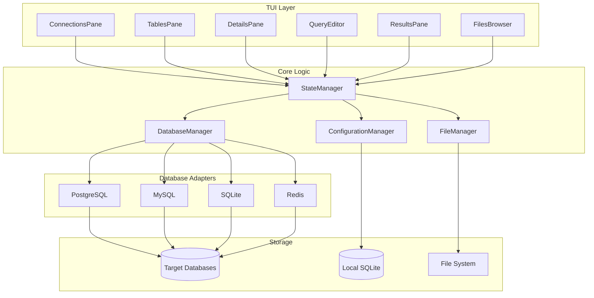

# Components

LazyTables is organized into **logical components** that map to the six-pane TUI layout and core functionality. Each component has clear responsibilities and well-defined interfaces.

## TUI Components

### ConnectionsPane
**Responsibility:** Display and manage database connections with real-time status indicators

**Key Interfaces:**
- `display_connections(connections: &[Connection]) -> Widget`
- `handle_connection_event(event: ConnectionEvent) -> Result<()>`

**Dependencies:** ConnectionManager, SQLite configuration database

**Technology Stack:** Ratatui List widget, async connection testing

### TablesPane
**Responsibility:** Browse database objects (tables, views, schemas) with database-specific metadata

**Key Interfaces:**
- `display_table_list(tables: &[TableInfo], database_type: DatabaseType) -> Widget`
- `handle_table_selection(table: &TableRef) -> Result<()>`

**Dependencies:** Active database connection, metadata cache

**Technology Stack:** Ratatui Tree widget for hierarchical display, database-specific icons

### DetailsPane
**Responsibility:** Show detailed metadata for selected database objects

**Key Interfaces:**
- `display_table_details(schema: &TableSchema) -> Widget`
- `display_connection_info(info: &ConnectionInfo) -> Widget`

**Dependencies:** Database adapters for metadata queries

**Technology Stack:** Ratatui Paragraph widget with formatted text, database-specific formatters

### QueryEditor
**Responsibility:** SQL query composition with vim-style editing and syntax highlighting

**Key Interfaces:**
- `handle_text_input(input: KeyEvent) -> Result<EditorAction>`
- `execute_query_at_cursor() -> Result<String>`
- `apply_syntax_highlighting(query: &str, database_type: DatabaseType) -> StyledText`

**Dependencies:** File manager for SQL files, database adapters for execution

**Technology Stack:** Custom text buffer with vim motions, syntect for highlighting

### ResultsPane
**Responsibility:** Display query results with pagination and data type rendering

**Key Interfaces:**
- `display_query_results(result: &QueryResult) -> Widget`
- `handle_pagination(direction: ScrollDirection) -> Result<()>`

**Dependencies:** Query results cache, viewport management

**Technology Stack:** Ratatui Table widget with virtual scrolling, custom data formatters

### FilesBrowser
**Responsibility:** Navigate and manage SQL files with current file indication

**Key Interfaces:**
- `display_file_tree(files: &[SqlFile]) -> Widget`
- `load_selected_file() -> Result<String>`

**Dependencies:** File system access, file watching service

**Technology Stack:** Ratatui List widget, notify for file change detection

## Core Logic Components

### DatabaseManager
**Responsibility:** Coordinate database connections and route operations to appropriate adapters

**Key Interfaces:**
- `get_adapter(database_type: DatabaseType) -> &dyn DatabaseAdapter`
- `execute_query(connection_id: Uuid, query: &str) -> QueryResult`
- `manage_connection_pool() -> Result<()>`

**Dependencies:** Database adapters (PostgreSQL, MySQL, SQLite, Redis)

**Technology Stack:** Tokio async runtime, connection pooling per database type

### StateManager
**Responsibility:** Centralized application state with immutable updates and event coordination

**Key Interfaces:**
- `update_state(action: StateAction) -> Result<()>`
- `get_current_state() -> &AppState`
- `subscribe_to_changes() -> Receiver<StateChange>`

**Dependencies:** All TUI panes, database manager

**Technology Stack:** Arc<RwLock<AppState>> for thread-safe state, tokio broadcast channels

### ConfigurationManager
**Responsibility:** Manage application settings and connection persistence using local SQLite

**Key Interfaces:**
- `load_connections() -> Result<Vec<Connection>>`
- `save_connection(connection: &Connection) -> Result<()>`
- `get_app_setting(key: &str) -> Option<String>`

**Dependencies:** SQLite local database, OS keychain for credentials

**Technology Stack:** SQLx for SQLite operations, keyring for secure storage

## Component Interaction Diagram

