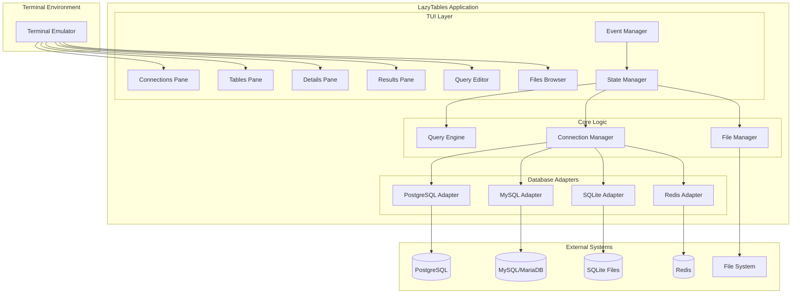

# High Level Architecture

## Technical Summary

LazyTables employs a **terminal-native architecture** built on Rust's async ecosystem with Ratatui providing the TUI foundation. The system uses a **six-pane fixed layout** with database adapters implementing a unified interface for PostgreSQL, MySQL, MariaDB, SQLite, and Redis. **Event-driven state management** coordinates pane updates and user interactions through vim-style keyboard navigation. The architecture prioritizes **terminal performance** (sub-100ms startup, 60fps scrolling) while maintaining **cross-platform compatibility** across major terminal emulators. This design achieves the PRD goal of creating the "LazyGit for databases" through elegant keyboard-driven workflows that rival GUI database tools.

## Platform and Infrastructure Choice

For a TUI application, the "platform" is the terminal ecosystem rather than cloud infrastructure:

**Platform Options Considered:**

1. **Native Terminal + Rust Ecosystem** ⭐ **RECOMMENDED**
   - Pros: Maximum performance, single binary, cross-platform, mature TUI libraries
   - Cons: Terminal capability variations, no web/mobile access
   - Stack: Ratatui + Tokio + native database drivers

2. **Cross-Platform Terminal (NCurses-based)**
   - Pros: Broader terminal compatibility, proven ecosystem
   - Cons: C FFI complexity, less Rust-native development experience
   - Stack: pancurses + async wrappers

3. **Terminal + Web Hybrid**
   - Pros: Both terminal and web access, broader user base
   - Cons: Complexity overhead, divides development focus
   - Stack: Ratatui + web terminal emulator

**Selected Platform:** Native Terminal + Rust Ecosystem
**Key Libraries:** Ratatui (TUI), Tokio (async runtime), Crossterm (terminal abstraction)
**Target Terminals:** Major terminal emulators (iTerm2, Terminal.app, Alacritty, Windows Terminal, GNOME Terminal)
**Deployment Host:** Single binary distribution for macOS, Linux (no Windows support per PRD)

## Repository Structure

**Structure:** Monorepo with feature-based organization
**Build Tool:** Native Cargo workspace (no additional monorepo tooling needed)
**Package Organization:** Single binary with modular crate structure for database adapters

```
lazytables/
├── Cargo.toml                 # Workspace root
├── src/                       # Main application
├── crates/                    # Internal crates
│   ├── database-adapters/     # Database connection abstractions
│   ├── tui-components/        # Reusable TUI widgets
│   └── query-engine/          # SQL parsing and execution
└── tests/                     # Integration tests
```

## High Level Architecture Diagram



## Architectural Patterns

- **Event-Driven Architecture:** TUI events drive state changes with async message passing between panes - _Rationale:_ Terminal input is inherently event-based, and this pattern enables responsive UI without blocking database operations
- **Adapter Pattern:** Unified database interface with database-specific implementations - _Rationale:_ Enables consistent UI across different database types while accommodating database-specific features
- **State Management Pattern:** Centralized application state with immutable updates - _Rationale:_ Prevents race conditions in async environment and simplifies debugging of complex UI interactions
- **Six-Pane Layout Pattern:** Fixed spatial organization with contextual focus management - _Rationale:_ Provides predictable navigation model essential for vim-style keyboard workflows
- **Async-First Pattern:** Non-blocking database operations with streaming results - _Rationale:_ Maintains UI responsiveness during long-running queries and large dataset operations
- **Plugin Architecture Pattern:** Modular database adapters with runtime selection - _Rationale:_ Enables optional database support and reduces binary size for unused databases
